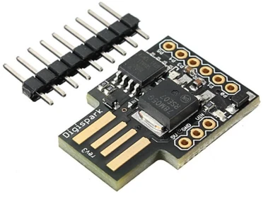

# RubberDuckyPresentation

Proyect with an intent on making

## Hardware

I am using the DigiSpark rubber ducky.



# Drivers and installs

Three things:

## Python

Install with winget (Windows):

```powershell
winget install -e --id Python.Python
```

Install with apt:

```bash
sudo apt install python3
```

You can also go to [the Python download page](https://www.python.org/downloads/)

And **you have to** download [this python script.](https://github.com/toxydose/Duckyspark/blob/master/Duckyspark_translator.py)

## Arduino IDE

Install with winget (Windows):

```powershell
winget install -e --id Arduino.Arduino
```

Other OS and more options in [Arduino's software page](https://www.arduino.cc/en/software)

**After install** go to _File &#8594; Preferences &#8594; Additional Boards Manager URLs_ and paste in the following text:

```
http://digistump.com/package_digistump_index.json
```

Now onto _Tools &#8594; Board &#8594; Boards Manager_. Look for and install `digistump AVR`

## DigiSpark drivers

We should have everything we need installed now. I case things don't work as intended you can install the drivers from these links:

[Windows(1.57MB)](https://drive.google.com/file/d/1trMhivBkRLfLepX1MOgFbzdDISkm_lRC/view?usp=sharing)

SHA256 CheckSum: 14F575FFBAF2E9BA6BA05B75426E90D7010E4650E1E27AACC2EF3F688AA4066E

[MacOS(162MB)](https://drive.google.com/file/d/1jSCyE4HMdNh-onag71Ol8xjYDYEx1-rp/view?usp=sharing)

SHA256 CheckSum: 84BE3FC0BE0C18563CB2B5E53971DA6AA83E20F1DE37E6DEBAE3B55F8B0EDBB3

**Note:** I was not able find Linux drivers, it might be simply because Linux does not need them or because they don't exist

# Rubber Ducky scripts

Arduino code is uploaded to the Rubber Ducky, but since writing that code is complex, we simplify it by writing simple instructions instead. And then use the _Duckyspark_translator.py_ file to create the actual .INO file we'll use.

Once we have a txt payload file written, we run the following command on out terminal:

```powershell
python3 Duckyspark_translator.py instructions.txt
```

The terminal should respond with a _Success!_ message.

Afterwards we can open the _digipayload.ino_ file it has created in the python script's folder, run it and folow it's instructions.

After that your Rubber Ducky is ready to be pluged in.

## Instruction list

DELAY n &#8594; Waits n milliseconds

STRING text &#8594; Presses corresponding keys to that text

GRI r &#8594; Presses windows key along with whatever other keys you want. Ej: Win+r

Fx 11 &#8594; Presses function keys. Ej: F11

REPEAT n &#8594; Repeats the preavious instruction n times

And here are a list of preaty self explanatory instructions:

ENTER, SHIFT, ALT, CTRL, SPACE, ESC, TAB

You can also combine them, like if I wanted to do _Ctrl+Shift+Enter_ I'd wright _CTRL SHIFT ENTER_

**Note:** If your using function keys with another instruction you can just wright _F_ and the key. Ej: ALT F4

## Payload files in this proyect

There are two instruction files in this proyect:

-   **Intro.txt** &#8594; Just a fun script to begin our presentation, it rickrolls for 9 seconds, closes the browser and opened the presentation.
-   **DNSpoisoning.txt** &#8594;  


## Other payloads

Take a look at [these other payloads.](https://github.com/hak5darren/USB-Rubber-Ducky/wiki/Payloads)

# Web Server
